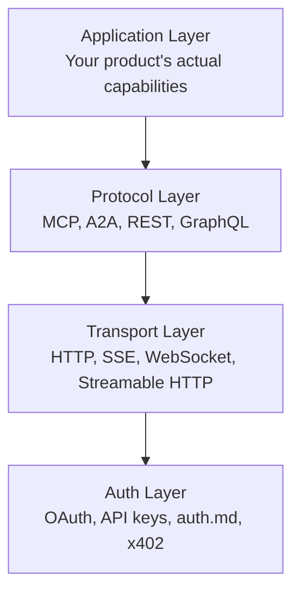

# Integration: Is the Plumbing There?

Auth gets the agent in the door. Integration determines whether it can actually *do* anything once inside.

This is where the agent needs to call your endpoints repeatedly, invoke tools, stream responses, recover from errors, and operate within constraints. Even with good auth, brittle responses or missing platform primitives cause silent task failure.

The ora.ai data tells the story: **only 27% of sites have functional agent integration**. MCP endpoints exist on 34% of products, but only 3% ship one with spec-grade tool descriptions, consistent naming, and Streamable HTTP transport.

## The Integration Layer Cake

Agent integration has multiple layers. Each layer is independent but complementary:



A well-integrated service nails all four. An agent-ready service at least has the protocol and transport layers right.

## Protocol Layer: MCP

**Model Context Protocol (MCP)** is the emerging standard for connecting agents to tools and data sources. Think of it as USB-C for agent integrations — one standard connector instead of a dozen custom ones.

### What MCP Gives You

MCP provides a standard way for agents to:
1. **Discover** what tools your service offers
2. **Call** those tools with structured parameters
3. **Receive** typed responses
4. **Stream** long-running operations

### A Minimal MCP Server

```typescript
import { McpServer } from "@modelcontextprotocol/sdk/server/mcp.js";
import { z } from "zod";

const server = new McpServer({
  name: "acme-crm",
  version: "1.0.0",
});

server.tool(
  "search_contacts",
  "Search contacts by name, email, or company",
  {
    query: z.string().describe("Search term"),
    limit: z.number().optional().describe("Max results (default: 20)"),
  },
  async ({ query, limit = 20 }) => {
    const contacts = await db.contacts.search(query, limit);
    return {
      content: contacts.map(c => ({
        type: "text",
        text: `${c.name} (${c.email}) - ${c.company}`,
      })),
    };
  }
);

server.tool(
  "create_deal",
  "Create a new deal in the pipeline",
  {
    name: z.string().describe("Deal name"),
    value: z.number().describe("Deal value in dollars"),
    stage: z.enum(["lead", "qualified", "proposal", "closed"]),
    contact_id: z.string().describe("Contact ID"),
  },
  async ({ name, value, stage, contact_id }) => {
    const deal = await db.deals.create({ name, value, stage, contact_id });
    return {
      content: [{ type: "text", text: `Deal created: ${deal.id} - ${name} ($${value})` }],
    };
  }
);
```

### MCP Best Practices for Agent Experience

1. **Descriptive tool names and descriptions** — An agent reads your tool list and decides what to call. Vague names like `action1` or `execute` tell it nothing.

   ```typescript
   // Bad
   server.tool("action1", "Do something", ...);
   
   // Good
   server.tool(
     "search_contacts",
     "Search contacts by name, email, or company. Returns up to 20 matching contacts with their basic information.",
     { query: z.string().describe("Search term (name, email, or company)") },
     ...
   );
   ```

2. **Consistent naming conventions** — Use `verb_noun` patterns. `search_contacts`, `create_deal`, `update_pipeline`, `delete_contact`. An agent encountering `search_contacts` and `contacts_search` on the same server will get confused.

3. **Structured, typed parameters** — Every parameter needs a type and a description. Use enums for fixed options. Use `.min()`, `.max()`, `.email()` validators.

   ```typescript
   // Bad
   server.tool("create_deal", "...", {
     data: z.string(), // What's in data? JSON? What shape?
   });
   
   // Good
   server.tool("create_deal", "...", {
     name: z.string().describe("Human-readable deal name"),
     value: z.number().min(0).describe("Deal value in USD"),
     stage: z.enum(["lead", "qualified", "proposal", "closed"]).describe("Current pipeline stage"),
   });
   ```

4. **Streamable HTTP transport** — MCP supports multiple transports. Streamable HTTP is the modern default. Don't use stdio for production servers.

5. **Return structured results** — Agents parse your response. Plain text is fine for display, but structured data is better for parsing.

   ```typescript
   return {
     content: [
       {
         type: "text",
         text: `Found 3 contacts matching "${query}"`,
       },
       {
         type: "resource",
         resource: {
           uri: `crm://contacts/${contact.id}`,
           mimeType: "application/json",
           text: JSON.stringify(contact),
         },
       },
     ],
   };
   ```

## Protocol Layer: A2A

**Agent-to-Agent (A2A)** is Google's protocol for agents to talk to *each other*. Where MCP connects an agent to a tool, A2A connects an agent to another agent.

Use A2A when:
- Your service exposes capabilities that are complex enough to warrant their own agent
- You want your agent to delegate tasks to specialized agents
- You need multi-agent orchestration across different vendors

```json
{
  "name": "CRM Orchestrator",
  "description": "Coordinates CRM operations including contact management, deal tracking, and email automation",
  "url": "https://crm.example.com/a2a",
  "capabilities": [
    { "name": "manage_pipeline", "description": "Full pipeline management with automatic stage transitions" },
    { "name": "email_followup", "description": "Send and track follow-up emails based on deal stage" }
  ]
}
```

A2A and MCP are complementary, not competing:
- **MCP**: Agent → Tool (how do I use this API?)
- **A2A**: Agent → Agent (can you handle this task for me?)

## Protocol Layer: REST API (The Foundation)

MCP and A2A sit on top of a good REST (or GraphQL) API. If your API is messy, wrapping it in MCP doesn't fix the underlying problems.

API design for agents shares best practices with good DX, but with extra emphasis on:

1. **Predictable URL patterns** — `/api/v1/contacts`, `/api/v1/deals`, `/api/v1/pipelines`. Not `/api/getContacts` mixed with `/api/v2/deal-list`.

2. **Consistent response shapes** — Every response follows the same envelope:
   ```json
   {
     "data": { ... },
     "meta": { "page": 1, "total": 47, "has_more": true },
     "errors": null
   }
   ```

3. **Pagination with clear signals** — `has_more: true`, `next_cursor: "abc123"`, not "check if the array is empty."

4. **Filtering and sorting** — `GET /contacts?status=active&sort=-created_at&limit=20`. Don't make agents fetch everything and filter client-side.

5. **Idempotency** — `POST /deals` with an `idempotency_key` header lets agents safely retry without creating duplicates.

## Transport Layer: Streaming

Agents working on long tasks need feedback. Streaming isn't just nice to have — it's essential for:
- Long-running operations (data processing, report generation)
- Multi-step workflows (batch imports, migrations)
- Real-time updates (monitoring, live dashboards)

**SSE (Server-Sent Events)** is the simplest way to add streaming:

```http
GET /api/v1/deals/import/stream
Accept: text/event-stream

event: progress
data: {"processed": 50, "total": 100, "current": "Acme Corp"}

event: progress
data: {"processed": 75, "total": 100, "current": "Beta Inc"}

event: complete
data: {"imported": 98, "failed": 2, "failed_ids": ["c_123", "c_456"]}
```

**MCP streaming** uses the built-in transport-level streaming:

```typescript
// Stream progress during a long-running tool call
async function* importContacts(query: string) {
  const results = await db.contacts.search(query);
  for (let i = 0; i < results.length; i++) {
    yield {
      content: [{ type: "text", text: `Processing ${i + 1}/${results.length}: ${results[i].name}` }],
    };
  }
}
```

## SDK and Client Libraries

While agents can call raw HTTP endpoints, SDKs make integration much easier:

```python
# Instead of:
import requests
response = requests.get("https://api.crm.example.com/v1/contacts", headers={"Authorization": f"Bearer {token}"})

# Provide:
from acme_crm import Client
client = Client(token="...")
contacts = client.contacts.search(query="acme")
```

Even better: SDKs that also expose MCP tool definitions or agent skill manifests, so agents can discover capabilities programmatically.

## Webhooks and Events

Agents don't just make requests — they also need to *receive* them. Webhooks let your service push events to agents:

```json
POST /webhooks/register
{
  "url": "https://agent.example.com/hooks/crm",
  "events": ["deal.created", "deal.stage_changed", "contact.updated"],
  "secret": "whsec_..."
}
```

**Best practices:**
- Use `Etag` headers so agents can poll efficiently when webhooks aren't possible
- Include full event payloads, not just IDs that require a follow-up request
- Use HTTPS with signature verification
- Support retry with `Retry-After` on delivery failure

## Practical Steps

1. **Audit your existing API** for consistency, pagination, and error responses (1-2 days)
2. **Add OpenAPI 3.x spec** at a well-known URL (1-3 days depending on API size)
3. **Build an MCP server** wrapping your existing API (2-5 days)
4. **Add SSE streaming** for long-running operations (1-2 days)
5. **Publish an SDK** for at least one language (1-2 weeks)
6. **Add webhook support** for key events (1-2 days)

**Further reading:** [MCP Specification](https://modelcontextprotocol.io/), [A2A Protocol](https://github.com/google/A2A), [Developer's Guide to AI Agent Protocols](https://developers.googleblog.com/developers-guide-to-ai-agent-protocols/) — see [References](references) for complete links.

## Measuring Integration

- [ ] Does your service expose an MCP endpoint?
- [ ] Do your MCP tools have descriptive names and descriptions?
- [ ] Do your MCP tools have typed, documented parameters?
- [ ] Do you use consistent `verb_noun` naming?
- [ ] Does your REST API have consistent URL patterns and response shapes?
- [ ] Do you support streaming for long-running operations?
- [ ] Do you publish an OpenAPI spec at a well-known URL?
- [ ] Do you have SDKs in at least one major language?
- [ ] Do you support webhooks for key events?
- [ ] Does your MCP server use Streamable HTTP transport?

## What's Next

Integration gives agents the tools. But what happens when things go wrong?

→ **[Errors & Recovery: Can Agents Self-Heal?](05-errors-and-recovery)**