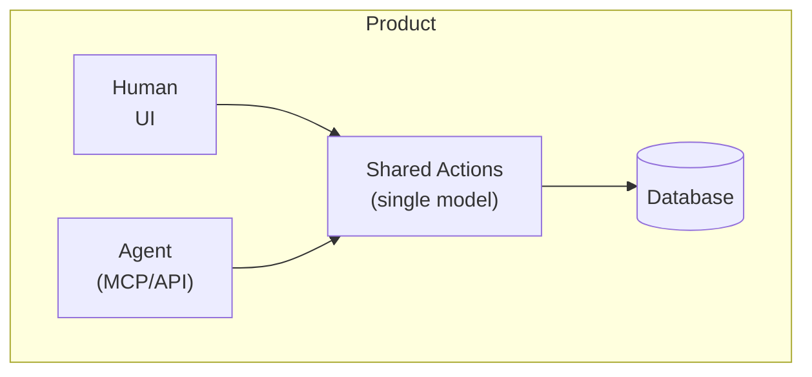

# Agent-Native Architecture

The previous chapters focused on making existing services work better for agents — adding `llms.txt`, fixing auth, improving error responses. This chapter is about something different: **building services where agents are a first-class user from day one.**

Most "AI features" today are bolt-ons: a chat panel in the corner that can summarize a document or draft a reply, but can't do everything a human can do in the product. Agent-native is the architectural discipline of building applications so agents and humans operate the same product through shared actions, data, permissions, and context.

## Agent-Enabled vs. AI-Native vs. Agent-Native

| Stage | Definition | Test |
|-------|-----------|------|
| AI-Enabled | AI features added to an existing product | Remove the AI. Does the product still work? If yes, it's AI-enabled. |
| AI-Native | AI is central to the product's value | Remove the AI. Does the product collapse? If yes, it's AI-native. |
| Agent-Native | AI is central AND agents have full product parity with the UI | Can both the UI and the agent operate the same workflows? If yes, it's agent-native. |

A chatbot in your CRM that drafts emails is AI-enabled. A research tool that only works through natural language is AI-native. An email client where you can triage manually AND the agent can archive, draft, label, and route through the same underlying actions — that's agent-native.

## The Five Principles of Agent-Native Architecture

### 1. Agent UI Parity

**Anything the UI can do, the agent can do.** And anything the agent can do should be visible, inspectable, or controllable through the product's interface.

If you can archive an email, create a dashboard, schedule a meeting, or render a video, the agent should be able to perform the same action through the same underlying capability. The agent should not be screen-scraping the UI or using a fragile side channel.

This doesn't mean the agent uses the visual interface. It means both the visual interface and the agent interface call the same underlying action model.



### 2. One Shared Action Model

Define each product capability once. From that single definition, generate:
- The UI component
- The API endpoint
- The MCP tool
- The A2A capability
- The CLI command
- The documentation

```typescript
import { defineAction } from "@your-app/core";
import { z } from "zod";

export const archiveEmail = defineAction({
  name: "archive_email",
  description: "Archive an email thread and remove from inbox",
  input: z.object({
    emailId: z.string(),
    reason: z.enum(["done", "spam", "later"]).optional(),
  }),
  output: z.object({
    archived: z.boolean(),
    threadId: z.string(),
  }),
  scope: "emails:write",
  destructive: false,
  idempotent: true,
  sideEffects: ["removes_from_inbox", "updates_unread_count"],
  async run({ emailId, reason }) {
    return await db.emails.archive(emailId, { reason });
  },
});
```

One action. Multiple surfaces. No drift.

### 3. Shared State, Data, and Context

The agent must know what the human is seeing. If you're looking at a customer record, the agent should operate on that record. If you select a paragraph and ask for a rewrite, the agent should know which paragraph.

This means:
- **UI writes navigation state** as the user moves through the app
- **A `view-context` action** gives the agent a snapshot of the current view
- **A `navigate` action** lets the agent move the UI
- **Both sides read and write the same database**

No "agent context window" separate from "user session state." The database is the coordination layer.

### 4. Protocol-Ready by Design

Protocol support is not a one-off integration project. It's a property of the architecture. If actions are the shared unit of product behavior, exposing them to MCP, A2A, a CLI, or an API becomes a routing problem, not a reimplementation.

```
Shared Action Model ──► Route to MCP
                    ──► Route to REST API
                    ──► Route to A2A
                    ──► Route to CLI
                    ──► Route to UI component
```

When you define a new action, it's automatically available on every surface. No building separate MCP tools, API endpoints, UI buttons, and CLI commands that gradually diverge.

### 5. Governed Execution

The agent operates inside the same permission model as the product:

- If you can't access a record, the agent can't access it on your behalf
- If sending an email requires confirmation, the agent respects that boundary
- Every action is logged, auditable, and (where appropriate) reversible

```typescript
export const deleteContact = defineAction({
  name: "delete_contact",
  scope: "contacts:delete",
  destructive: true,
  requiresConfirmation: true,    // Agent must ask human before executing
  auditLog: true,                 // Log every invocation
  reversible: true,               // Can be undone within 24h
  maxRetries: 0,                  // Don't auto-retry destructive actions
});
```

Governance is what makes agent-native trustworthy. Without it, you have a powerful but dangerous assistant. With it, you have a powerful and safe collaborator.

## AGENTS.md: The Onboarding File

Just as `llms.txt` helps agents discover your service, `AGENTS.md` (or `.cursorrules`, `.claude/`, `CLAUDE.md`) helps agents understand how to work with your codebase or project.

An `AGENTS.md` file in your project root tells visiting agents:

```markdown
# Project: AcmeCRM

## Architecture
- Next.js frontend, Express API backend, PostgreSQL database
- Actions defined in `src/actions/` (single action model)
- MCP server in `src/mcp/`
- All endpoints documented in `openapi.yaml`

## Conventions
- Use `verb_noun` naming for all actions
- All responses follow `{ data, meta, errors }` envelope
- Destructive actions require `requiresConfirmation: true`
- All database queries use parameterized statements

## Agent Guidelines
- Always read the relevant action file before modifying an action
- Test all changes against `src/actions/__tests__/`
- Never modify database migrations directly; create new ones
- Run `npm run check` before committing
```

## Workspace Customization

Agent-native apps should ship with a workspace:

```
my-app/
├── AGENTS.md           # Shared instructions
├── LEARNINGS.md        # Durable team memory
├── skills/             # Custom agent skills
│   ├── triage-email.md
│   └── weekly-report.md
├── .mcp.json           # Connected MCP servers
└── src/
    └── actions/        # Shared action model
```

This is what makes the agent personal and the product programmable. The agent learns your conventions, remembers team decisions, and has access to custom workflows — all stored in the same database-backed state as the rest of the product.

## Practical Steps

1. **Audit your current architecture** — Where does the UI have capabilities that the API doesn't? (1-2 days)
2. **Define a shared action model** — Start with your top 10 actions and refactor them into a single definition (1 week)
3. **Add `AGENTS.md`** to your project (1 hour)
4. **Build MCP support** from your action model (2-3 days, given it's already defined)
5. **Add permission scoping** to all actions (read/write/destructive) (3-5 days)
6. **Add audit logging** for all agent-performed actions (1-2 weeks)
7. **Build state synchronization** between UI and agent contexts (1-2 weeks)

## Measuring Agent-Native Maturity

- [ ] Can agents perform every action that the UI can?
- [ ] Is there a single action definition that generates both UI and API?
- [ ] Do UI actions and agent actions read/write the same database?
- [ ] Can the agent see what the user is currently viewing?
- [ ] Are destructive actions marked and require confirmation?
- [ ] Is every action logged with who (human or agent) performed it?
- [ ] Can actions be undone or reversed?
- [ ] Does your project have an `AGENTS.md` file?

## What's Next

Agent-native architecture is the ideal. But along the way, there are many traps. Let's catalog the most common ones.

→ **[End-User Experience](06b-end-user-experience)**