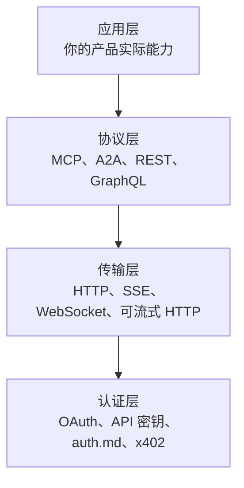

# 集成：管道是否就绪？

认证让智能体（Agent）进了门。集成决定了它进去之后能不能真正*做*事情。

这时智能体（Agent）需要反复调用你的接口、调用工具、流式响应、从错误中恢复，并在约束条件下运作。即便认证没问题，脆弱的响应或缺失的平台原语也会导致任务静默失败。

ora.ai 的数据说明了问题：**只有 27% 的站点具备可用的智能体（Agent）集成**。有 34% 的产品存在 MCP 接口，但仅有 3% 真正提供了符合规范的工具描述、一致的命名和可流式 HTTP 传输。

## 集成分层蛋糕

智能体（Agent）集成包含多个层次，各层独立但互补：



一个好的集成服务要四层都过硬。一个面向智能体（Agent）的服务至少要把协议层和传输层做好。

## 协议层：MCP

**模型上下文协议（MCP）**是将智能体（Agent）连接到工具和数据源的新兴标准。可以把它想象成智能体（Agent）集成的 USB-C——一个标准连接器，替代十几个自定义方案。

### MCP 能给你什么

MCP 为智能体（Agent）提供了标准化的方式来完成以下操作：
1. **发现**你的服务提供哪些工具
2. **调用**这些工具并传入结构化参数
3. **接收**类型化响应
4. **流式**传输长时间运行的操作

### 一个最小化的 MCP 服务器

```typescript
import { McpServer } from "@modelcontextprotocol/sdk/server/mcp.js";
import { z } from "zod";

const server = new McpServer({
  name: "acme-crm",
  version: "1.0.0",
});

server.tool(
  "search_contacts",
  "Search contacts by name, email, or company",
  {
    query: z.string().describe("Search term"),
    limit: z.number().optional().describe("Max results (default: 20)"),
  },
  async ({ query, limit = 20 }) => {
    const contacts = await db.contacts.search(query, limit);
    return {
      content: contacts.map(c => ({
        type: "text",
        text: `${c.name} (${c.email}) - ${c.company}`,
      })),
    };
  }
);

server.tool(
  "create_deal",
  "Create a new deal in the pipeline",
  {
    name: z.string().describe("Deal name"),
    value: z.number().describe("Deal value in dollars"),
    stage: z.enum(["lead", "qualified", "proposal", "closed"]),
    contact_id: z.string().describe("Contact ID"),
  },
  async ({ name, value, stage, contact_id }) => {
    const deal = await db.deals.create({ name, value, stage, contact_id });
    return {
      content: [{ type: "text", text: `Deal created: ${deal.id} - ${name} ($${value})` }],
    };
  }
);
```

### 面向智能体（Agent）体验的 MCP 最佳实践

1. **描述性的工具名称和描述**——智能体（Agent）读取工具列表后决定调用哪个。模糊的名称如 `action1` 或 `execute` 传递不了任何信息。

   ```typescript
   // 差
   server.tool("action1", "Do something", ...);
   
   // 好
   server.tool(
     "search_contacts",
     "Search contacts by name, email, or company. Returns up to 20 matching contacts with their basic information.",
     { query: z.string().describe("Search term (name, email, or company)") },
     ...
   );
   ```

2. **一致的命名规范**——使用 `动词_名词` 模式。`search_contacts`、`create_deal`、`update_pipeline`、`delete_contact`。如果智能体（Agent）在同一台服务器上同时遇到 `search_contacts` 和 `contacts_search`，它会感到困惑。

3. **结构化的类型化参数**——每个参数都需要有类型和描述。固定选项使用枚举。使用 `.min()`、`.max()`、`.email()` 等校验器。

   ```typescript
   // 差
   server.tool("create_deal", "...", {
     data: z.string(), // data 里有什么？JSON？什么结构？
   });
   
   // 好
   server.tool("create_deal", "...", {
     name: z.string().describe("Human-readable deal name"),
     value: z.number().min(0).describe("Deal value in USD"),
     stage: z.enum(["lead", "qualified", "proposal", "closed"]).describe("Current pipeline stage"),
   });
   ```

4. **可流式 HTTP 传输**——MCP 支持多种传输方式。可流式 HTTP 是现代默认选择。生产环境服务器不要使用 stdio。

5. **返回结构化结果**——智能体（Agent）会解析你的响应。纯文本适合展示，但结构化数据更适合解析。

   ```typescript
   return {
     content: [
       {
         type: "text",
         text: `Found 3 contacts matching "${query}"`,
       },
       {
         type: "resource",
         resource: {
           uri: `crm://contacts/${contact.id}`,
           mimeType: "application/json",
           text: JSON.stringify(contact),
         },
       },
     ],
   };
   ```

## 协议层：A2A

**智能体对智能体协议（A2A）**是 Google 为智能体（Agent）之间*相互*通信而设计的协议。如果说 MCP 是把智能体（Agent）连接到工具，那么 A2A 就是把一个智能体（Agent）连接到另一个智能体（Agent）。

### 何时使用 A2A

以下场景适合使用 A2A：
- 你的服务暴露的能力复杂到值得配备自己的智能体（Agent）
- 你希望自己的智能体（Agent）能将任务委托给专门的智能体（Agent）
- 你需要跨供应商的多智能体（Agent）编排

```json
{
  "name": "CRM Orchestrator",
  "description": "Coordinates CRM operations including contact management, deal tracking, and email automation",
  "url": "https://crm.example.com/a2a",
  "capabilities": [
    { "name": "manage_pipeline", "description": "Full pipeline management with automatic stage transitions" },
    { "name": "email_followup", "description": "Send and track follow-up emails based on deal stage" }
  ]
}
```

A2A 和 MCP 是互补关系，而非竞争关系：
- **MCP**：智能体（Agent）→ 工具（我怎么用这个 API？）
- **A2A**：智能体（Agent）→ 智能体（Agent）（你能帮我处理这个任务吗？）

## 协议层：REST API（基础层）

MCP 和 A2A 建立在良好的 REST（或 GraphQL）API 之上。如果你的 API 一团糟，用 MCP 包装它并不能解决底层的问题。

面向智能体（Agent）的 API 设计与好的开发者体验（DX）有共同的最佳实践，但有几项需要额外强调：

1. **可预测的 URL 模式**——`/api/v1/contacts`、`/api/v1/deals`、`/api/v1/pipelines`。不要混用 `/api/getContacts` 和 `/api/v2/deal-list`。

2. **一致的响应结构**——每个响应都遵循相同的外壳：
   ```json
   {
     "data": { ... },
     "meta": { "page": 1, "total": 47, "has_more": true },
     "errors": null
   }
   ```

3. **带明确信号的分页**——`has_more: true`、`next_cursor: "abc123"`，而不是“检查数组是否为空”。

4. **过滤和排序**——`GET /contacts?status=active&sort=-created_at&limit=20`。别让智能体（Agent）拉取全部数据然后在客户端自己过滤。

5. **幂等性**——`POST /deals` 配合 `idempotency_key` 请求头，让智能体（Agent）可以安全地重试而不创建重复记录。

## 传输层：流式

执行长任务的智能体（Agent）需要反馈。流式不仅仅是个锦上添花的功能——它对以下场景至关重要：
- 长时间运行的操作（数据处理、报表生成）
- 多步骤工作流（批量导入、数据迁移）
- 实时更新（监控、实时仪表盘）

**SSE（Server-Sent Events）**是最简单的流式方案：

```http
GET /api/v1/deals/import/stream
Accept: text/event-stream

event: progress
data: {"processed": 50, "total": 100, "current": "Acme Corp"}

event: progress
data: {"processed": 75, "total": 100, "current": "Beta Inc"}

event: complete
data: {"imported": 98, "failed": 2, "failed_ids": ["c_123", "c_456"]}
```

**MCP 流式**使用内置的传输层流式传输：

```typescript
// 在长时间运行的工具调用中流式传输进度
async function* importContacts(query: string) {
  const results = await db.contacts.search(query);
  for (let i = 0; i < results.length; i++) {
    yield {
      content: [{ type: "text", text: `Processing ${i + 1}/${results.length}: ${results[i].name}` }],
    };
  }
}
```

## SDK 和客户端库

虽然智能体（Agent）可以直接调用原始 HTTP 端点，但 SDK 能让集成容易得多：

```python
# 不要这样：
import requests
response = requests.get("https://api.crm.example.com/v1/contacts", headers={"Authorization": f"Bearer {token}"})

# 而是提供：
from acme_crm import Client
client = Client(token="...")
contacts = client.contacts.search(query="acme")
```

更好的是：SDK 还应该暴露 MCP 工具定义或智能体（Agent）技能清单，让智能体（Agent）能通过编程方式发现能力。

## Webhook 和事件

智能体（Agent）不只是发起请求——它们还需要*接收*请求。Webhook 让你的服务能将事件推送给智能体（Agent）：

```json
POST /webhooks/register
{
  "url": "https://agent.example.com/hooks/crm",
  "events": ["deal.created", "deal.stage_changed", "contact.updated"],
  "secret": "whsec_..."
}
```

**最佳实践：**
- 使用 `Etag` 请求头，让智能体（Agent）在无法使用 Webhook 时也能高效轮询
- 在事件负载中包含完整数据，而不只是需要二次请求才能获取的 ID
- 使用 HTTPS 并进行签名验证
- 投递失败时支持带`重试等待（Retry-After）`的重试

## 实操步骤

1. **审查现有 API**的 URL、分页和错误响应一致性（1-2 天）
2. **在公开 URL 上放置 OpenAPI 3.x 规范文档**（根据 API 规模，1-3 天）
3. **构建 MCP 服务器**，封装现有 API（2-5 天）
4. **为长时间运行的操作添加 SSE 流式支持**（1-2 天）
5. **至少为一种语言发布 SDK**（1-2 周）
6. **为关键事件添加 Webhook 支持**（1-2 天）

**扩展阅读：** [MCP 规范](https://modelcontextprotocol.io/)、[A2A 协议](https://github.com/google/A2A)、[AI 智能体协议开发者指南](https://developers.googleblog.com/developers-guide-to-ai-agent-protocols/)——完整链接见[参考资料](references)。

## 集成度量

- [ ] 你的服务是否暴露了 MCP 端点？
- [ ] 你的 MCP 工具是否有描述性的名称和描述？
- [ ] 你的 MCP 工具是否有类型化且有文档的参数？
- [ ] 你是否使用一致的 `动词_名词` 命名规范？
- [ ] 你的 REST API 是否有一致的 URL 模式和响应结构？
- [ ] 长时间运行的操作是否支持流式传输？
- [ ] 你是否在公开 URL 上发布了 OpenAPI 规范文档？
- [ ] 你是否提供了至少一种主流语言的 SDK？
- [ ] 关键事件是否支持 Webhook？
- [ ] 你的 MCP 服务器是否使用可流式 HTTP 传输？

## 下一步

集成为智能体（Agent）提供了工具。但事情出错时又会怎样？

→ **[错误与恢复：智能体能否自愈？](05-errors-and-recovery)**
